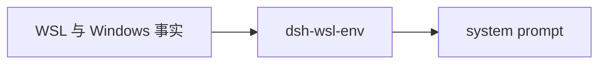

# dsh-wsl-env
> **套件安装：** 见 [dsh-wsl-kit](https://github.com/173787247/dsh-wsl-kit)。推荐 `KIT_SET=daily` | `llm` | `github` | `full`。故障树：[TROUBLESHOOTING.zh.md](https://github.com/173787247/dsh-wsl-kit/blob/master/docs/TROUBLESHOOTING.zh.md)。


DeepSeek Harness 插件：把 **WSL / Windows** 路径与 shell 事实注入 system prompt。

属于 **[dsh-wsl-kit](https://github.com/173787247/dsh-wsl-kit)**。

[English → README.md](./README.md)

## 在套件里的位置

把 WSL 和 Windows 路径事实写进 system prompt。模型不会去调用它。



整套关系图和版本快照：[dsh-wsl-kit 中文说明](https://github.com/173787247/dsh-wsl-kit/blob/master/README.zh.md)。本插件是 **0.3.0**（daily，也在 llm）。不要把那份总表抄进本 README。


---
## 兼容性

| 项 | 值 |
|----|----|
| **插件** | `dsh-wsl-env` **0.3.0** |
| **最低 dsh** | ≥ **0.1.2**（Windows 中继 `:3081` 一次性 `?token=`） |
| **最新验证** | 以 [dsh-wsl-kit 兼容性](https://github.com/173787247/dsh-wsl-kit#compatibility-2026-09) 为准（当前 **`0.1.7-alpha.2`**）— 套件唯一真源 |
| **套件档位** | `daily`（亦含于 `github` / `full`；fetch+net 亦在 `llm`） |
| **云端 Flash** | settings / `llm-deepseek` 使用 **`deepseek-flash`**（V4.1 Flash）；本插件不配置模型 id |
| **Agent Teams** | 上游实验包；本插件不依赖 |

套件版本地板：[`check-plugin-versions.sh`](https://github.com/173787247/dsh-wsl-kit/blob/master/scripts/check-plugin-versions.sh)。故障树：[TROUBLESHOOTING.zh.md](https://github.com/173787247/dsh-wsl-kit/blob/master/docs/TROUBLESHOOTING.zh.md)。

## 为什么需要

Agent 跑在 WSL（Linux）里时，模型仍常按 Windows 习惯写 `C:\`、PowerShell。本插件往 system prompt 注入一小段事实，让它优先用 Linux 路径，并了解 `/mnt/c` 与 Node 24 代理注意点。

## 注入内容

刻意写短：

- 发行版名称与 Linux 用户
- 路径映射（`C:\Users\...` → `/mnt/c/Users/...`）
- `/mnt/c` 上的 CRLF / git 注意点
- 日常工作优先 Linux 家目录，而不是 Windows 盘挂载点
- 需要代理时提醒 `NODE_USE_ENV_PROXY=1`（Node 24 必须设置后才会读 `HTTP(S)_PROXY`）

## 安装

```sh
dsh plugin --profile web add github:173787247/dsh-wsl-env
# 或：
dsh plugin --profile web add /absolute/path/to/dsh-wsl-env
```

重启 `dsh web`，并开**新会话**（已有会话会保留旧 prompt）。

## 验证

1. 随便发一条消息。
2. Trajectory → **SYSTEM** → **System Prompt**（不是 Tools 页）。
3. 搜索 `Windows Subsystem for Linux`。

应能看到发行版名与路径映射。界面会把各段拼在一起，内部 id `runtime:wsl-windows` 不一定以标题形式出现。

非 WSL 主机默认不注入（`when: wsl`）。

## 配置

后续 profile 层一旦写 `config`，会**整对象替换**——要保留的键必须全部重写：

```yaml
- id: dsh-wsl-env
  name: dsh-wsl-env
  config:
    when: wsl          # 或: always
    order: 15
    extraNotes: "Prefer /home over /mnt/c for new files."
```

| 键 | 默认 | 含义 |
|----|------|------|
| `when` | `wsl` | 仅 WSL 注入，或 `always` |
| `order` | `15` | prompt 段落顺序 |
| `extraNotes` | `""` | 追加到该段的运维说明 |

## 测试

```sh
npm test
```

## 许可

MIT
